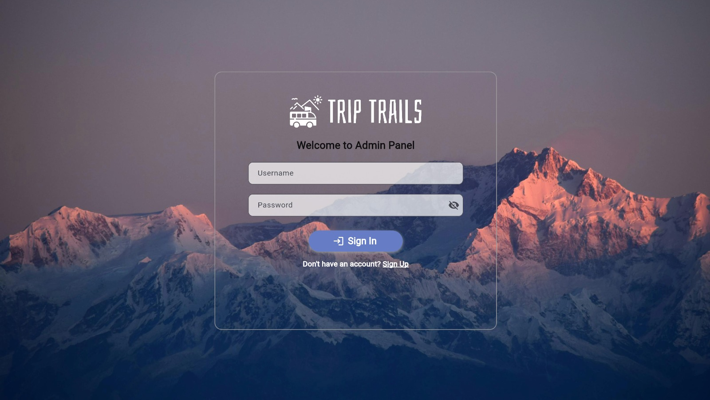
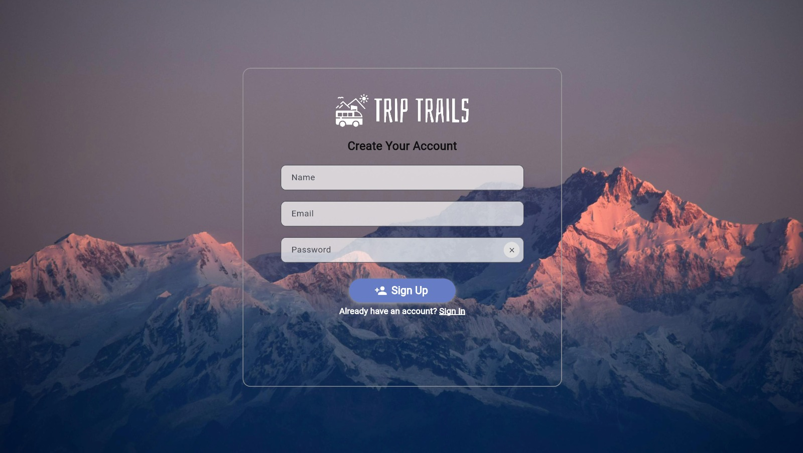
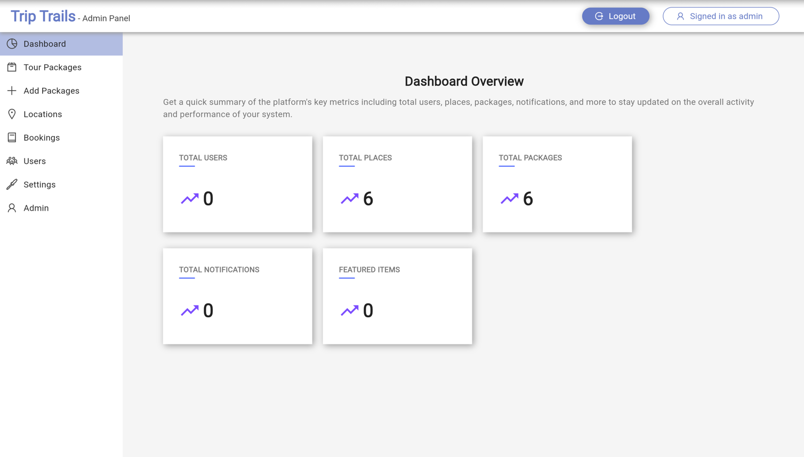
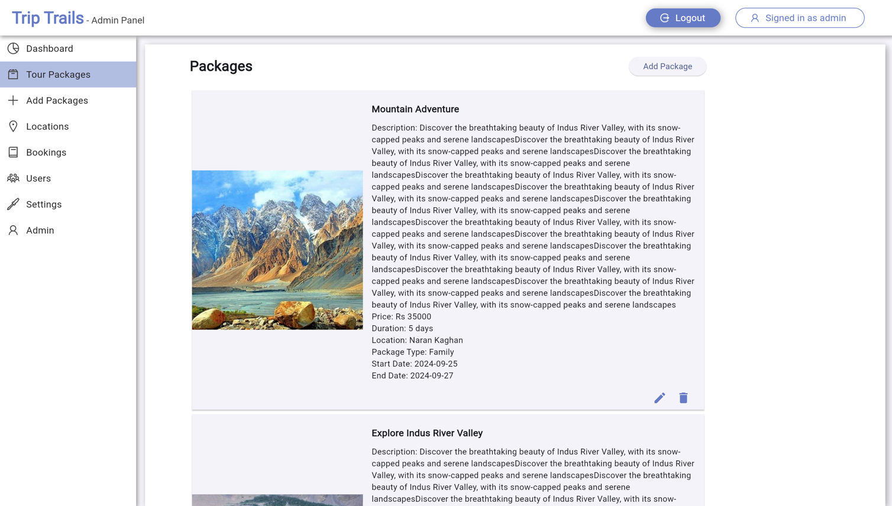
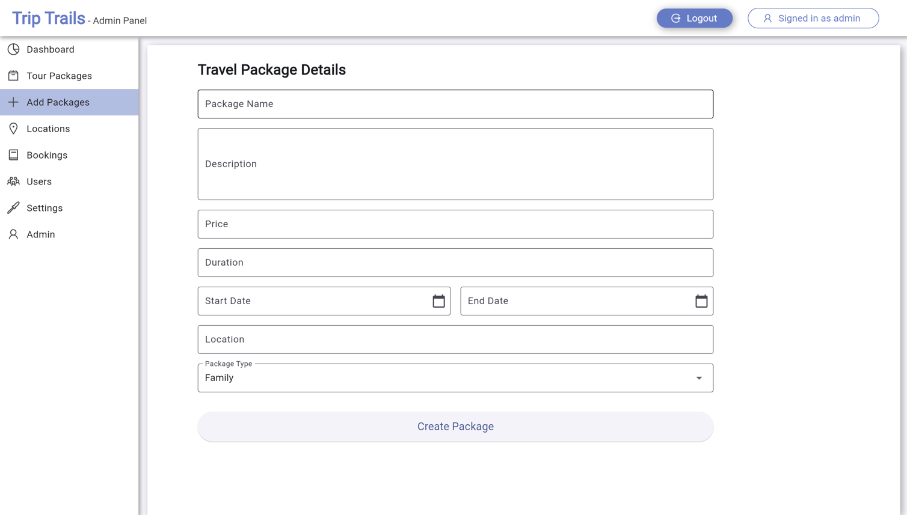
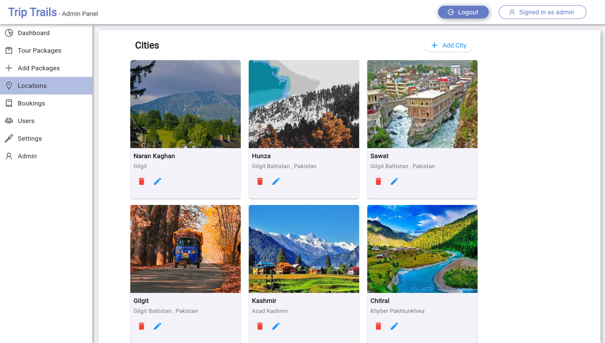
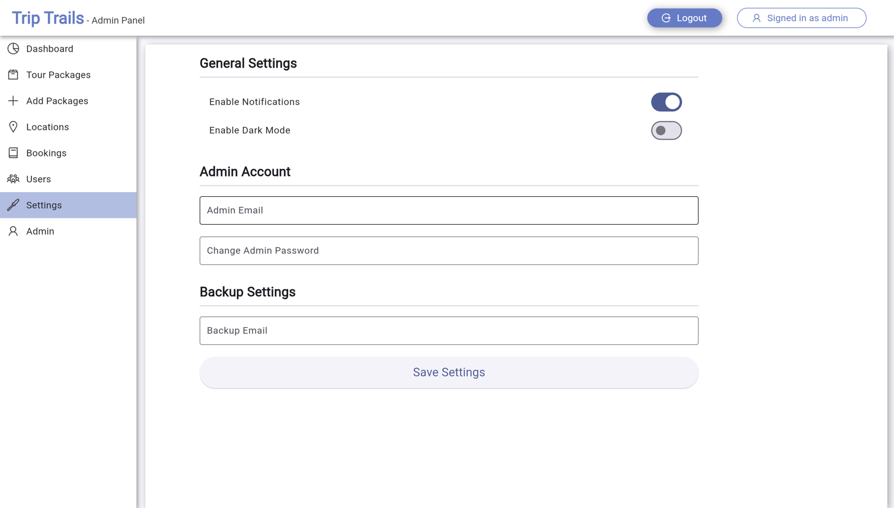

Travel App
A Flutter-based web application for the admin panel of a travel app, featuring login/signup functionality. The frontend is built with Flutter Web, while the backend is powered by Node.js with Express.js, and MongoDB is used for the database.

Getting Started
This project is a starting point for building the admin panel for managing user authentication, bookings, and other travel-related tasks.

Technologies Used:
Frontend: Flutter Web
Backend: Node.js with Express.js
Database: MongoDB

Features:
Login and signup functionality for admin users.
Manage travel bookings, user data, and travel packages.
Secure user authentication and authorization.
Real-time data sync with MongoDB.

Screenshots

LOGIN SCREEN 

SIGNUP SCREEN

DASHBOARD

TOUR PACKAGES

ADD PACKAGES

LOCATIONS

SETTINGS

Resources
To get started with Flutter development, you can check out these resources:

Lab: Write your first Flutter app
Cookbook: Useful Flutter samples
For more detailed Flutter documentation, visit the Flutter online documentation, which offers tutorials, samples, guidance on mobile development, and a full API reference.
